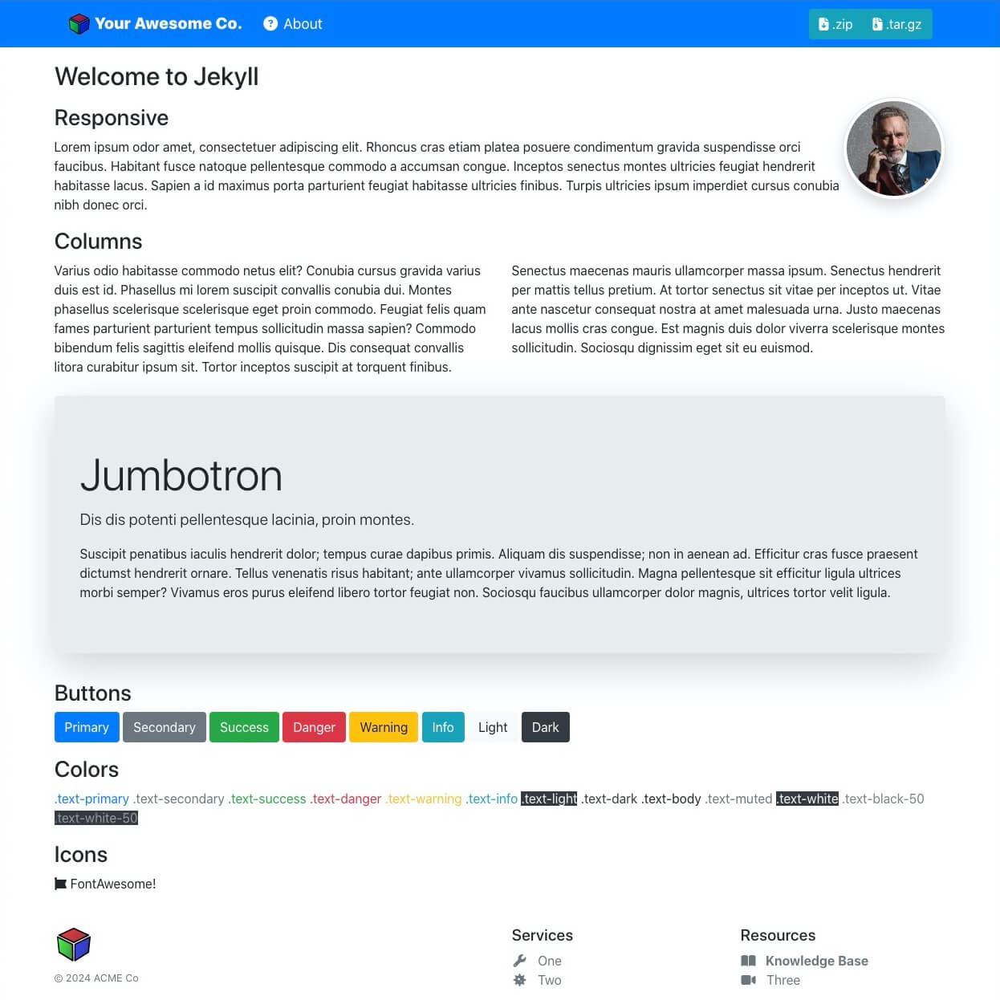

<center>

</center>

&nbsp;<br>&nbsp;

A [**Jekyll**](https://jekyllrb.com/) Theme shaped arround:
- [**Bootstrap** 4](https://github.com/twbs/bootstrap/tree/v4.6.2)
- [**Bootsrap Dark** *(4)*](https://github.com/vinorodrigues/bootstrap-dark)
- [**FontAwesome** 5](https://fontawesome.com/v5/icons/)


<table>
  <tr><td align="center"><br><small>Light mode</small></td><td align="center"><br><small>Dark mode</small></td></tr>
  <tr><td align="center" colspan="2"><a href="https://tecsmith.github.io/ts-jekyll-bs/">Theme Preview</a></td<</tr>
</table>

## Installation

> `TO DO - Docs`

## Contents At-A-Glance

`ts-jekyll-bs` is scaffolded with the `jekyll new-theme` and can be set up to run with zero-config.  However, if you wish to add complementary content like nav bars, then some configuration is required.

###

Refers to files within the `_layouts` directory, that define the markup for your theme.

  - `base.html` &mdash; The base layout that lays the foundation for subsequent layouts. The derived layouts inject their
    contents into this file at the line that says ` {{ content }} ` and are linked to this file via *Front Matter* declaration `layout: base`.
  - `page.html` &mdash; The layout for your documents that contain Front Matter, but are not posts.
  - `post.html` &mdash; The layout for your posts.


## Developing with

#### Set up a new site in Jekyll

```bash
jekyll new PATH --blank
```
> See [base file tweaks](#base-file-tweaks) for notes on optional modifications to the files generated by this step.

Then `cd` to `PATH`. *(Substitute `PATH` with your site folder name.)*

#### Initialize a new Bundler project

```bash
bundle init
```

#### Edit `Gemfile` to add Jekyll, this theme, and `jeyyll-remote-theme` as a dependency

```rb
gem "jekyll", '~> 4.3'

gem 'ts-jekyll-bs', '>= 0.1.0', :git => 'http://github.com/tecsmith/ts-jekyll-bs', branch: 'main'

group :jekyll_plugins do
  gem 'jekyll-remote-theme', '~> 0.4'
end
```

#### Edit `_config.yml` with this theme and `jeyyll-remote-theme`

```yaml
remote_theme: https://github.com/tecsmith/ts-jekyll-bs

plugins:
  - jekyll-remote-theme
```

#### *(Optional)* Configure Bundler to install gems in a specific directory

```bash
bundle config set --local path ".bundle/vendor"
```

#### Run `bundle install` to fetch and install the gems

```bash
bundle install
```

#### Base file tweaks

> ***{Optional}***

The `jekyll new` command generates a few file assumptions that can be tweaked to make the theme work better.

##### Edit `_layouts/default.html`

Add the `base` layout to the Front Matter, and remove generated content except `{{ content }}`.

```html
---
layout: base
---

{{ content }}
```

##### Delete `_sass/base.scss`

Delete the file `_sass/base.scss`.  This is not needed.

##### Edit `assets\css\main.scss`

Delete the line `@import "base";`.  This is not needed.  The file should start with only the bare Front Matter

```scss
---
---

// ... future edits here
```

##### Edit `index.md`

Change the `default` layout to `base` in the Front Matter section.

```md
---
layout: base
title: "Happy Jekylling!"
---

## You're ready to go!

Start developing your Jekyll website.
```


#### Develop and test

```bash
bundle exec jekyll serve --open-url --livereload --livereload-port 4001 --trace
```

## Editing

- This theme is based on Bootstrap 4 - see https://getbootstrap.com/docs/4.6/getting-started/introduction/ for HTML styling.

- This theme uses FontAwesome 5 *("free" sub-set)* - see https://fontawesome.com/v5/search for icons that can be used.

  Use:

  ```html
  <i class="fas fa-question-circle"></i>
  ```

  Where `question-circle` is the icon name


## Deployment

### `jekyll-remote-theme` and Missing Template Files


For some reason, there are files in this template that do not propagate to the generated site when using `jekyll-remote-theme`.

To get around this you will need to manually copy a few files from this template to your site's source root.  These are:

```bash
404.html
browserconfig.xml
site.webmanifest
sitemap.xsl
.htaccess  # optional copy (or rename) of htaccess.txt *
```

> * **Note:** you will need to rename `htaccess.txt` to `.htaccess` i you're self hosting.  This will not work on a Github Pages site.

You will <ins>also</ins> need to edit the `_config.yml` file to *"`include`"* those files:

```yaml
include:
  - '404.html'
  - 'browserconfig.xml'
  - 'site.webmanifest'
  - 'sitemap.xsl'
  - `.htaccess`  # optional copy (or rename) of `htaccess.txt`
```

### FavIcon

This template automatically generates the appropriate minimal images required for browser favourite icon *(a.k.a. "FavIcon")* usage.  You will need to provide the following images placed in your site's source root:

```bash
android-chrome-192x192.png
android-chrome-512x512.png
apple-touch-icon.png       # 180x180
favicon-16x16.png
favicon-32x32.png
favicon.gif                # 16x16
favicon.ico                # 64x64
favicon.png                # 1024x1024, compress with http://tinypng.com
favicon.svg                # 1024x1024, compress with https://vecta.io/nano
```

> Recommended images sizes are in the file names, or commented above.

It also generates Open Graph metadata *(for use in Facebook or (Twitter) X links)*, and that too will need the following images:

```bash
site-image-1200x630.png
site-image-310x150.png
```

## License

[](LICENSE.md)
[](CODE_OF_CONDUCT.md)

The theme is available as open source under the terms of the [MIT License](http://opensource.org/licenses/MIT).


&nbsp;<br>&nbsp;

---
Made with &#9829; by **Vino Rodrigues**
